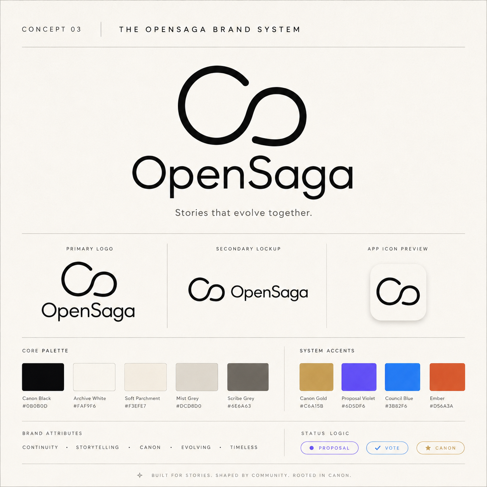

# OpenSaga Brand System

OpenSaga's visual identity is a neutral archive that lets each fictional world bring its own mood.

## Product Rule

**OpenSaga is monochrome. Worlds are colorful. Canon is gold.**

The platform should feel like a high-end library, wiki, archive, and creative governance system. It should not feel like one giant colorful brand competing with user-created worlds.

## Core Brand Palette

| Role | Hex | Usage |
|---|---:|---|
| Canon Black | `#0B0B0D` | Logo, primary text, authority, primary CTA |
| Archive White | `#FAF9F6` | Main Paper background |
| Soft Parchment | `#F3EFE7` | Warm panels, empty states, lore surfaces |
| Mist Grey | `#DCD8D0` | Borders, dividers, passive controls |
| Scribe Grey | `#6E6A63` | Secondary text and supporting copy |
| Canon Gold | `#C6A15B` | Canon badges, accepted entries, official moments |

## Canon Loop Status Colors

| Status | Hex | Meaning |
|---|---:|---|
| Proposal Violet | `#6D5DF6` | Imagination, new proposals, AI ideation |
| Council Blue | `#3B82F6` | Voting, decision process, governance action |
| Canon Gold | `#C6A15B` | Accepted truth, official entries, permanent moments |
| Ash Grey | `#9A948C` | Rejected, archived, inactive, historical |
| Ember | `#D56A3A` | Conflict, contradiction, needs review |

## World Color Rule

Worlds may define their own `accentColor`. OpenSaga uses that accent only on world-specific surfaces such as world cards, world genre pills, and world hub highlights. Global navigation, primary CTAs, and system-level controls stay in the neutral archive palette.

This creates a stable product identity while still letting dark fantasy, cyberpunk, cozy village, space opera, and other world styles feel distinct.
